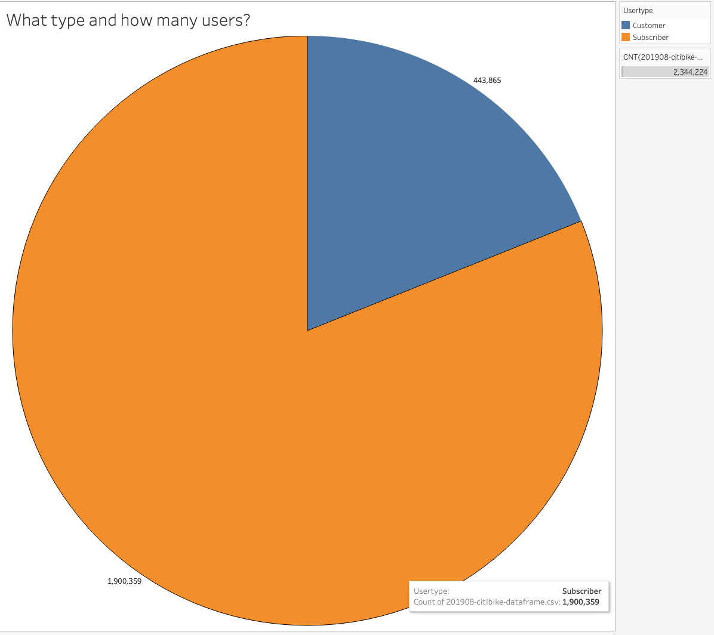
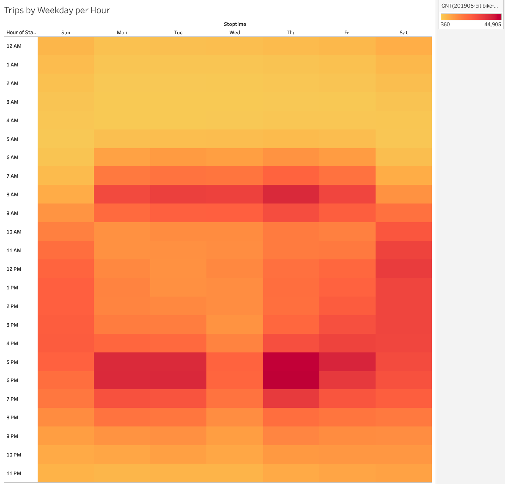
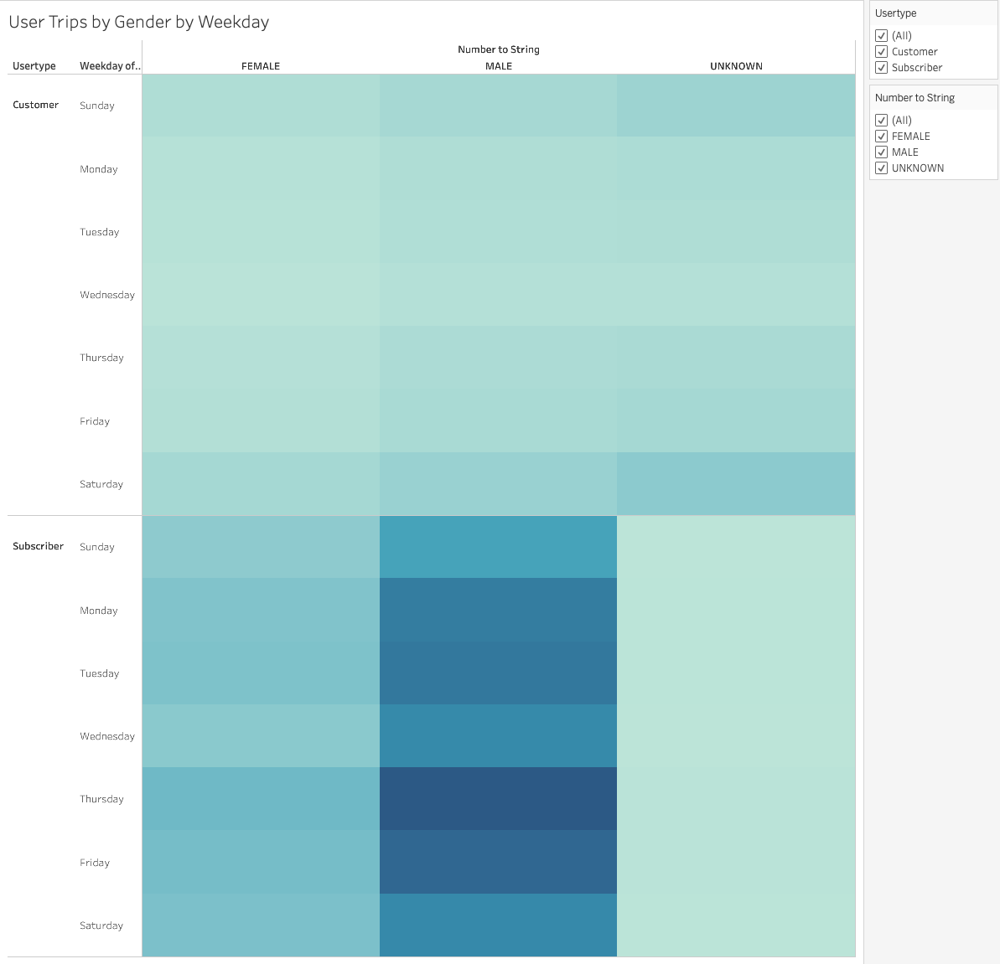
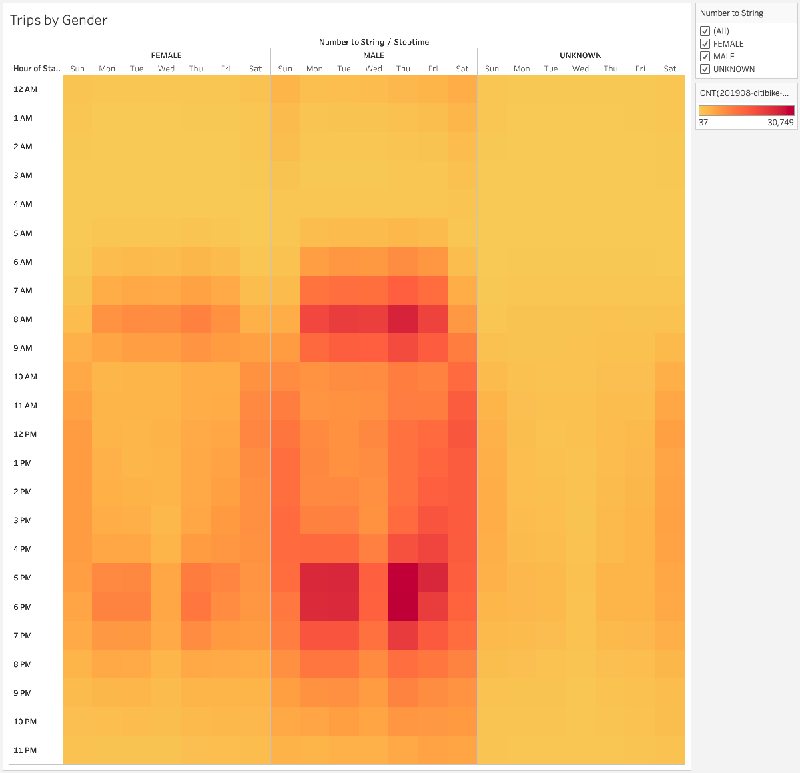
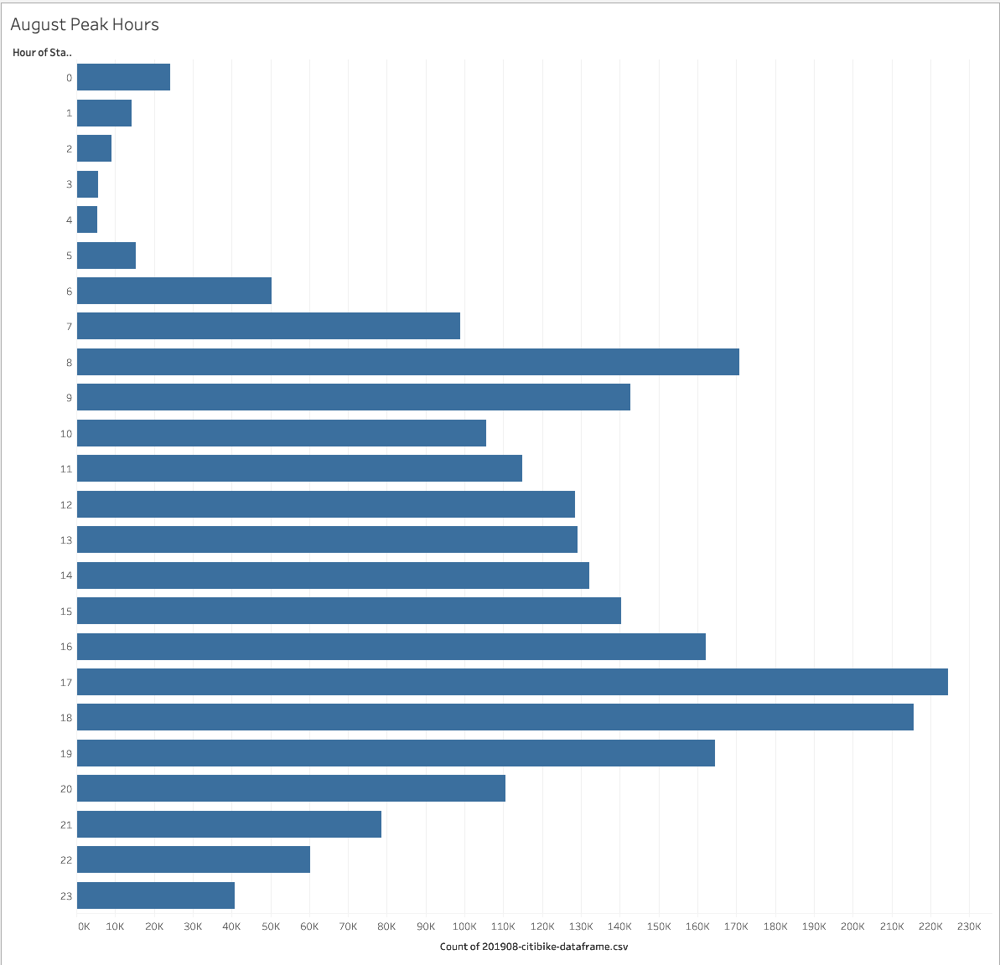
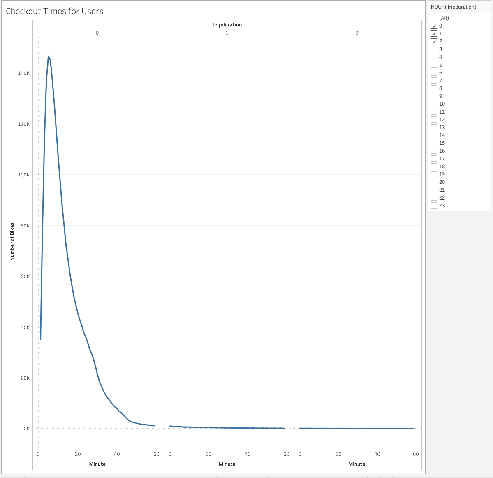
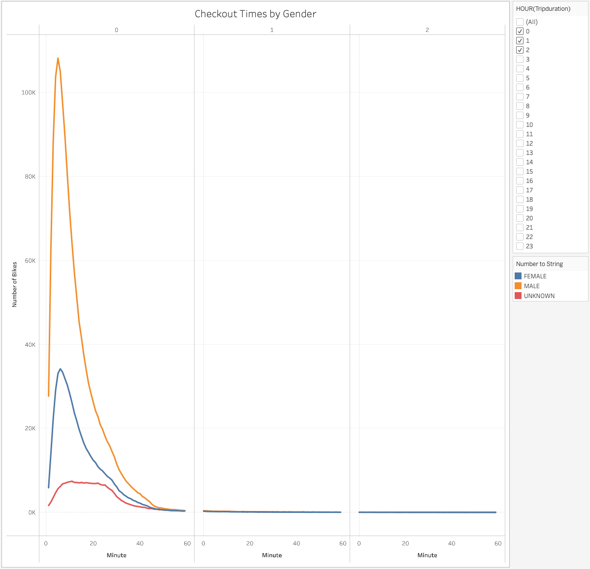

# Overview of the analysis

A vacation trip to New City spurred a startup idea for a bike sharing company in Des Moines, Idaho.  In order to properly fund the startup, the crew needs to investigate the data from the CitiBike trip data to see if it could provide a proof of concept for potential investors.  To avoid overstating riding during summer month we are going to look at August data.

## Explain the purpose of this analysis.

We have the data to present to our investors, but we need a better way to communicate our findings.  Our choice of data visualization tool for this project was Tableau Public.  It is a free software that provides dynamic and stunning graphs with the ability to make dashboards and Storylines. 

## Results: 

The data for Citibikes was taken from a public source so there are no worries about private information getting released.  This data had to be cleaned and transformed before it could be used.  Most of the data could be manipulated inside of Tableau.  Before we loaded the data, we had to change the datatype for trip duration.  The easiest way to do this transformation was to use pandas.  This step of the data manipulation is found in the Jupiter notebook attached in this repository. 

Out of the 2.3 Million customers more than 80% were yearly subscribers. This provides a steady consistent revenue stream.  See pie chart below showing the total count of trips and users types.

During the week, people travel between the hours of 6-9am and 5-7pm. Trips on the weekend are more spread out from the hours of 8am -7pm. 

Most users were male utilizing the bikes throughout the week. This will give us an opportunity to target more women since males may already be more likely to subscribe.

Given the times of usage, the subscribers are most likely using the bikes as a way to get to work. Weekends are more spread out so most likely being used for sightseeing.

Hours of usages are low from the hours of 2-4am. This would be a perfect time to perform the maintenance and checks on the bikes.

Most bikes are only checked out for less than 1 hour. In fact, the average trip times is around 5 mins. This allows many users access to the bikes.

Even though the average trip is only 5 mins, we did not find a large difference in trip time by gender.

## Summary: 

Provide a high-level summary of the results and two additional visualizations that you would perform with the given dataset.

Two additional data visualizations that may provide more insight:
1. The data for the age of the user looked to be incomplete or at a minimum not filled in properly.  We can see this from the fact some users are born in 1886.  It could provide some insight if we could narrow down reasonable ages and determine gender of those age groups.  
2. Plotting starting station on a map.  When it is time to investigate closer, we might want to find out what was common to those locations (housing, restaurants, hotels...).  

